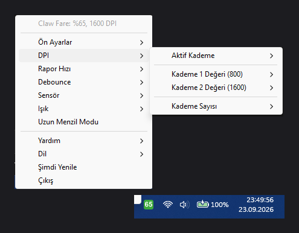

# Claw CrossFire AIR：システムトレイからの操作

🇹🇷 [Türkçe](README.tr.md) · 🇬🇧 [English](README.md) · 🇪🇸 [Español](README.es.md) · 🇫🇷 [Français](README.fr.md) · 🇩🇪 [Deutsch](README.de.md) · 🇷🇺 [Русский](README.ru.md) · 🇨🇳 [中文](README.zh.md) · 🇯🇵 **日本語** · 🇰🇷 [한국어](README.ko.md) · 🇸🇦 [العربية](README.ar.md)

ワイヤレスマウス **Claw CrossFire AIR V1** 用の小さなシステムトレイアプリです。メーカーのソフトウェアも DLL も不要で、USB HID を通じてマウスと直接通信します。Windows 対応、Linux 対応はベータです。



## 機能

| | |
|---|---|
| **バッテリー** | トレイに大きな数字で残量を表示、充電中は黄色の枠。充電の開始と終了、満充電、残量 20% と 10% で通知します。マウスがスリープ中はアイコンに `II` が表示され、マウス未接続時はアイコンが隠れます。 |
| **すべての設定を右クリックメニューに** | DPI 段階（値、現在の段階、段階数）、レポートレート、デバウンス、モーションシンク、角度補正、リップル制御、最高パフォーマンス、ライティングのモード、色、明るさ、速度、移動中の消灯、消灯までの時間、DPI インジケーター、長距離モード。書き込みはすべてマウスから読み戻して検証します。 |
| **編集できる 5 つのプリセット** | ゲーム、デスクトップ、精密、省電力、プレゼン。ワンクリックで適用、マウスの現在の設定をプリセットに保存、名前の変更、初期化。`config.json` に保存されます。 |
| **ヘルプ** | ヘルプのサブメニューに各設定が並び、クリックすると短い説明が通知で表示されます。「ガイドを開く」はすべての説明をスクロールできるウィンドウに表示します。 |
| **10 言語** | Türkçe、English、Español、Français、Deutsch、Русский、中文、日本語、한국어、العربية。システム言語に従い、メニューから切り替え可能で、選択は記憶されます。 |
| **軽量** | トレイアイコンひとつだけ。サービスもドライバーもなく、`config.json` 以外は自分のフォルダーの外に何も書きません。希望すれば Windows と一緒に起動します。 |

> メーカーとは無関係です。プロトコルはメーカーのソフトウェアの動作を観察してリバースエンジニアリングしたもので、**CrossFire AIR V1**（PixArt PAW3325、ファームウェア v2.0、2.4 GHz レシーバー）でのみテストしています。自己責任でご利用ください。

## インストール

### 方法 A：実行ファイル（Python 不要）

1. [Releases](https://github.com/Yerlifan/claw-crossfire-air-tray/releases) ページから `ClawTray_<バージョン>_win64.zip` をダウンロードし、任意のフォルダーに展開します。
2. `ClawTray.exe` を実行します。アイコンがトレイに表示されます（`^` の中に隠れていることがあります）。
3. 任意で、スタートメニュー、デスクトップ、スタートアップのショートカットを作成します：
   ```powershell
   powershell -ExecutionPolicy Bypass -File kurulum.ps1
   ```

実行ファイルは署名されていないため、初回に Windows SmartScreen が警告することがあります。「詳細情報、実行」を選ぶか、方法 B を使ってください。

### 方法 B：ソースから

必要条件：Windows 10/11（または Linux、方法 C 参照）、Python 3.10 以降。

```powershell
git clone https://github.com/Yerlifan/claw-crossfire-air-tray.git
cd claw-crossfire-air-tray
pip install -r requirements.txt
pythonw claw_tray.py
```

アンインストール：`kurulum.ps1 -Kaldir` を実行してフォルダーを削除します。コマンドライン：`--status` で状態表示、`--lang ja` で言語指定、`--guide` でガイドを開きます。

### 方法 C：Linux（ベータ、実機では未検証）

Linux ではマウス自体にドライバーは不要で、このアプリはトレイのバッテリー表示と設定画面を追加するだけです。Linux 版はマウスを接続していない仮想マシンでしか検証できていません。実機からの報告を歓迎します。

```bash
./linux/kurulum.sh        # udev ルール（sudo）、pip パッケージ、.desktop + 自動起動
```

Debian/Ubuntu のパッケージ：`sudo apt install python3-gi gir1.2-ayatanaappindicator3-0.1 python3-tk`。GNOME では *AppIndicator* 拡張も有効にしてください。アンインストール：`./linux/kurulum.sh -u`。

## 知っておくこと

- **CrossFire ソフトウェアとは同時に動作しません。** 両方が同時にマウスと通信すると CrossFire がクラッシュします（マウスには影響ありません）。そのため CrossFire の実行中はこのアプリが一時停止します（アイコン `!`）。CrossFire はアンインストールして構いません。このアプリは依存していません。
- マウスがスリープ中（約 1 分間操作なし）は設定を書き込めません。アイコンに `II` が表示され、マウスを動かすと復帰します。
- 問題が起きた場合は、メーカーソフトウェアの *Restore* でマウスを工場出荷状態に戻せます。
- マクロとボタン割り当ては意図的に対象外です。

## プロトコルの詳細

パケット形式、コマンド表、設定メモリのマップは[英語版 README](README.md#how-it-works) に記載しています。`claw_proto.py` がプロトコル層のすべてで、単独でも使えます。

## ライセンス

MIT、[LICENSE](LICENSE) を参照してください。
